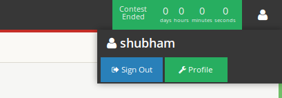
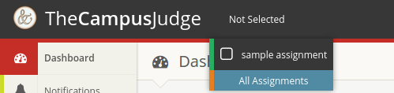
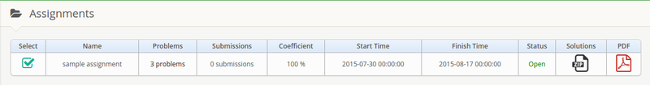

#The Campus Judge

[The Campus Judge](https://github.com/shubham1559/The-Campus-Judge/) is a free and open source online judge for C, C++, Java and Python programming languages based on [Sharif Judge](https://github.com/mjnaderi/Sharif-Judge).

Profile
------------
Other users can see your details. You can view and edit your profile here.

 

Dashboard
----------
This is the first page you see when you login. It has calendar and notification panel for quick access.

Notifications
---------------
You can view all the notifications here.

Assignments
-----------
Here you will see all the assignments and their details. You can select assignment here. you can also select the assignment from the dropdown menu or the assignments page.

###submissions
Total submissions for that assignment.

###coefficient
This is percentage of score which you get for the assignment currently.
this will decrease over time.

###status
You can submit only if it is Open.

###solution
You can download solution if it is available for the assignment.

###pdf
This pdf has all the questions for the assignment.

Problems
------
Here you will see all the problems for the selected assignments. If you select a problem you will see the problem statement for that problem. In case of any ambiguity or doubt you can use comment box below the problem statement to contact the contest admin. 

Submit
-------------
You can submit you solution from here. You can also submit the solution directly from the problem page.
Either you can upload file for the problem or you can Paste you code in the given box. 
While Submitting in java if you are uploading a file then you must have same class name and file name. If you are submitting code for that then you should use code as class name.

Final Submissions
----------
All the submissions which are used to calculate your score are shown here.

All Submissions
-------------
All your submissions are shown here.
If the assignment is Public then you can also see others code.

Scoreboard
--------
Assignment scoreboard is here.

Docs
---------
You can read about the judge and how to use it here. 

