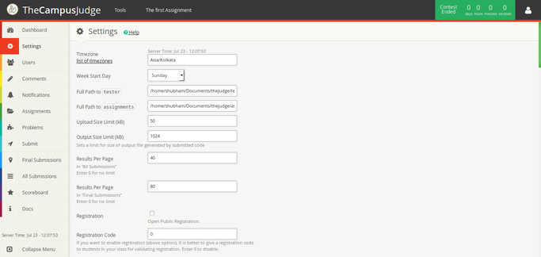
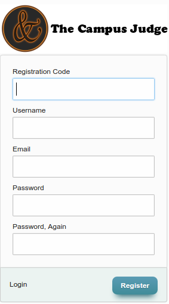

# Settings

You can change the settings for this judge on "Settings" page. You will see this page:



The following settings are there in the settings page:

Timezone
--------------

This should be one of php standard timezones. this is used to manage time of your judge.

Weekstart
-------------
change this to make your calendar start at a different day.

Path to tester and assignments directory
----------------
These should have the absolute path of tester and assignments. make sure they are writable by php. if not, change the permissions.

File size limit and results per page
---------------------------
file size limits are maximum file size for upload and output of a code respectively. Results per page are used for paging in "All submissions" and "Final Submissions".

Registration
--------------------------
If you want your users to register themselves to the judge then enable this feature. If this feature is enabled then you will see a register button on login screen where a user can register himself.

Registration page is like this:



Registration code is a code that is used as security for Registrations. This is required for a registration. if you want certain people to register then give this code to them. If you want to disable this then simply put a "0" there.

Log
------------------------
This is used to enable or disable log on admin side.

Maximum no of users in a team
--------------------
This is maximum no of persons possible in a team. This will be visible in team profile

Submit Penalty
-----------------
This is time penalty in milliseconds given for each incorrect submission. This will affect the scoreboard. This will not change the scoreboard immediately the change will be applied when scoreboard is calculated after it.

Default coefficient rule
----------------
You can write a PHP script here that calculates the coefficient multiplied by scores. This will be used as default for assignments.
Your script must put coefficient (from 0 to 100) in variable `$coefficient`. You can use variables `$extra_time` and `$delay`. `$extra_time` is the total extra time given to users in seconds (the extra time that you entered in Extra Time field) and `$delay` is number of seconds passed from finish time (can be negative).

This PHP script should not contain `<?php` , `<?` , `?>` tags.
a sample is given here:

```php
if ($delay<=0)
  // no delay
  $coefficient = 100;

elseif ($delay<=3600)
  // delay less than 1 hour
  $coefficient = ceil(100-((30*$delay)/3600));

elseif ($delay<=86400)
  // delay more than 1 hour and less than 1 day
  $coefficient = 70;

elseif (($delay-86400)<=3600)
  // delay less than 1 hour in second day
  $coefficient = ceil(70-((20*($delay-86400))/3600));

elseif (($delay-86400)<=86400)
  // delay more than 1 hour in second day
  $coefficient = 50;

elseif ($delay > $extra_time)
  // too late
  $coefficient = 0;
```


